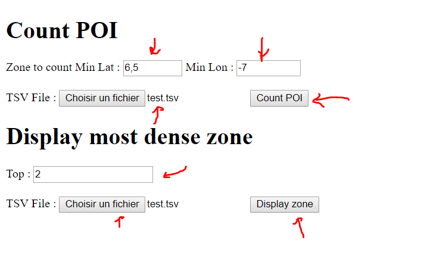

# Le code
Voir dans [src/main/java/com/semako/taskhappn](src/main/java/com/semako/taskhappn)

# Les tests
Voir dans [src/test/java/com/semako/taskhappn](src/test/java/com/semako/taskhappn)

# Guide de démarrage rapide

- Prérequis : **Avoir Java 1.8**
- Clonez ce repo git ou juste télécharger le zip
- Double cliquez sur Build.jar ou exécutez le en ligne de commande
- Ouvrir dans un navigateur web http://localhost:8080

J'ai fait une interface web basique pour tester les deux exercices.

*(Le fichier build-jar pèse 16 mo, c'est normal, il contient un serveur tomcat embarque pour tester rapidement sans rien installé)*

Le rendu donne à peu près ça.

Le fichier [test.tsv](test.tsv) est dans le dossier. Vous pouvez le modifier ou utilisez un autre fichier.

# Structure

C'est un projet **Maven**. J'ai rajouté **Spring Boot** pour faire le serveur web. En dehors de ça je ne me sers d'aucune librairie.

Pas besoin d'installer maven, il y a un wrapper inclus.

`mvnw test`
Lance les tests.

`mvnw spring-boot:run`
Lance le service web sur le port 8080

# Résolution du problème

Le code est commenté et accessible dans le fichier [src/main/java/com/semako/taskhappn/World.java](src/main/java/com/semako/taskhappn/World.java)

## Commentaires

À priori la difficulté principale était de faire attention aux points présents sur les lignes et qui pouvaient appartenir à 2 ou 4 zones à la fois.

Je fais quelque tests pour savoir si c'est le cas.

Je voulais aussi un truc performant en mémoire. Donc pas de copie de gros tableau de valeurs, je suis passé principalement par des Streams.

J'utilise des objets immutables Zone comme clé dans un dictionnaire de compteurs atomiques. Je ne crée le compteur d'une zone que si elle contient des points.

J'utilise une map accessible en concurrence et un compteur atomique parce que pour me challenger un peu j'ai voulu faire un traitement en parallèle. En pratique, je ferais d'abord des tests de performances pour décider de la meilleur approche.

Quite à la performance en temps, le problème en lui même n'est pas compliqué. Compter des occurrences se fait en O(n). Pour avoir le top k,j'ai préféré faire un **tri une seule fois** en nlog(n) parce que de toute façon je conserve le résultat en mémoire et qu'il peut y avoir plusieurs requête sur le serveur web, à la longue ça serait plus efficace.

Remarque si un point apparaît deux fois, il sera compter deux fois. Le sujet n'a pas précisé si c'était le comportement voulu.
De toute façon, s'il faut éviter les doublons on va être obliger de stocker quelque part tout les points qu'on a déjà rencontrés.
Alors qu'ici j'essaye de faire le traitement à la volée.

# Si vous avez des questions contactez moi. Au plaisir.
